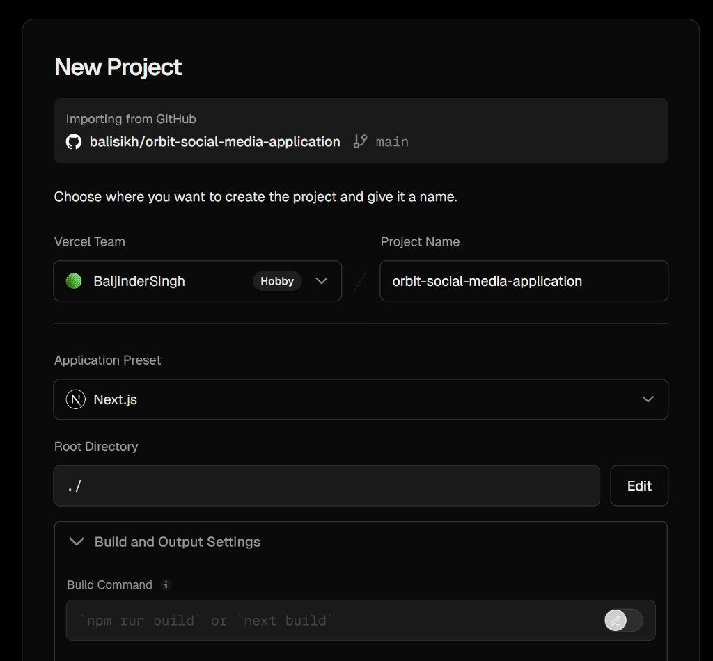
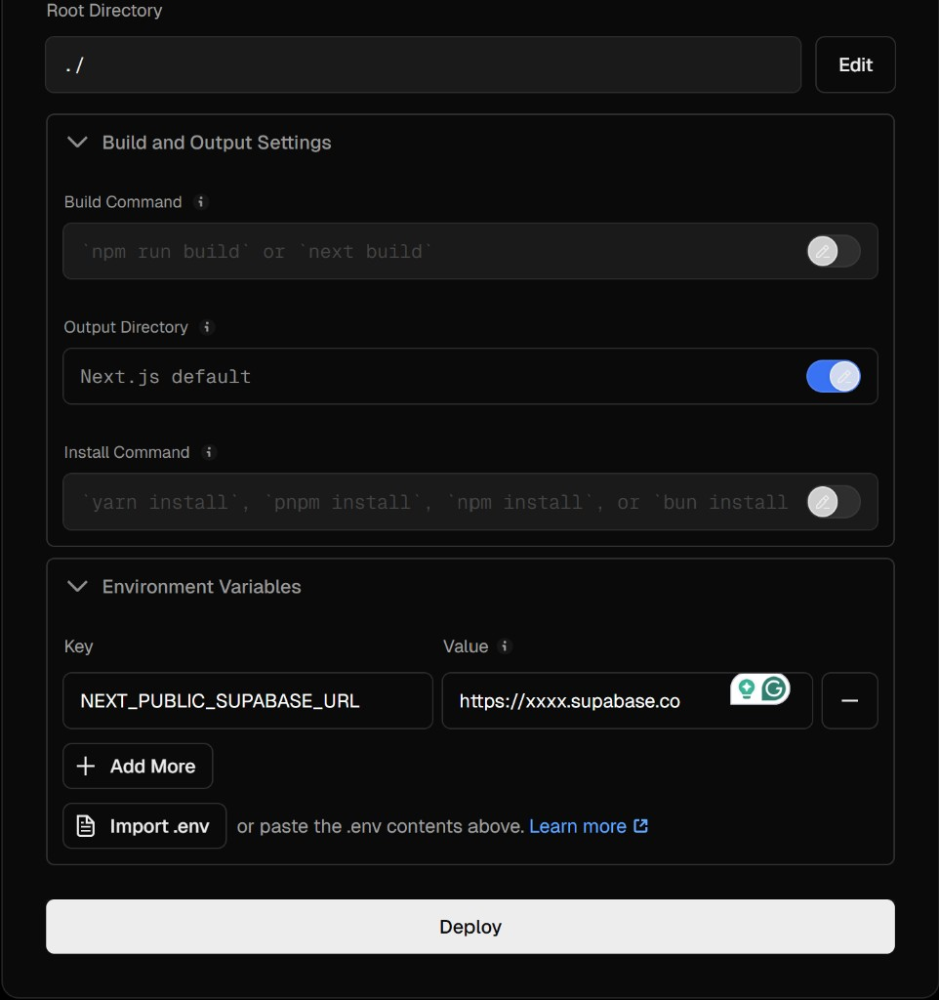
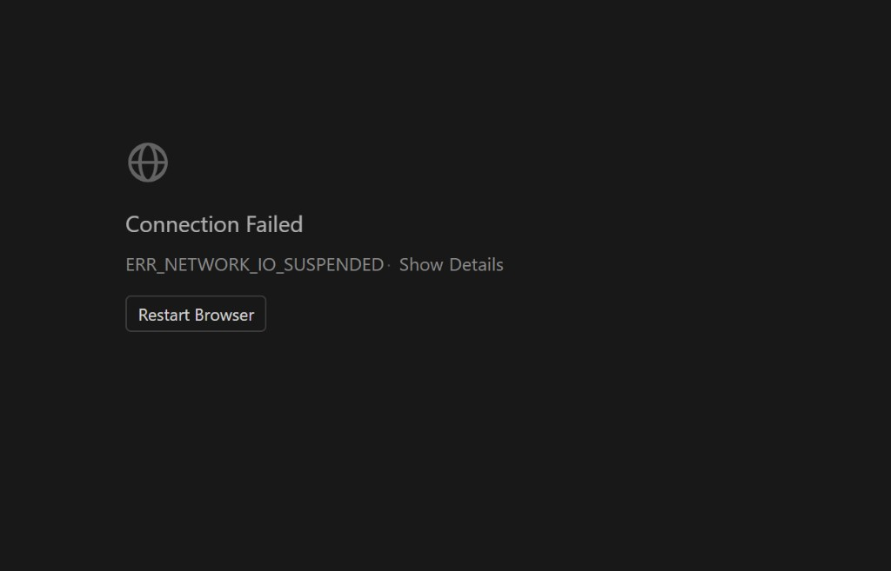
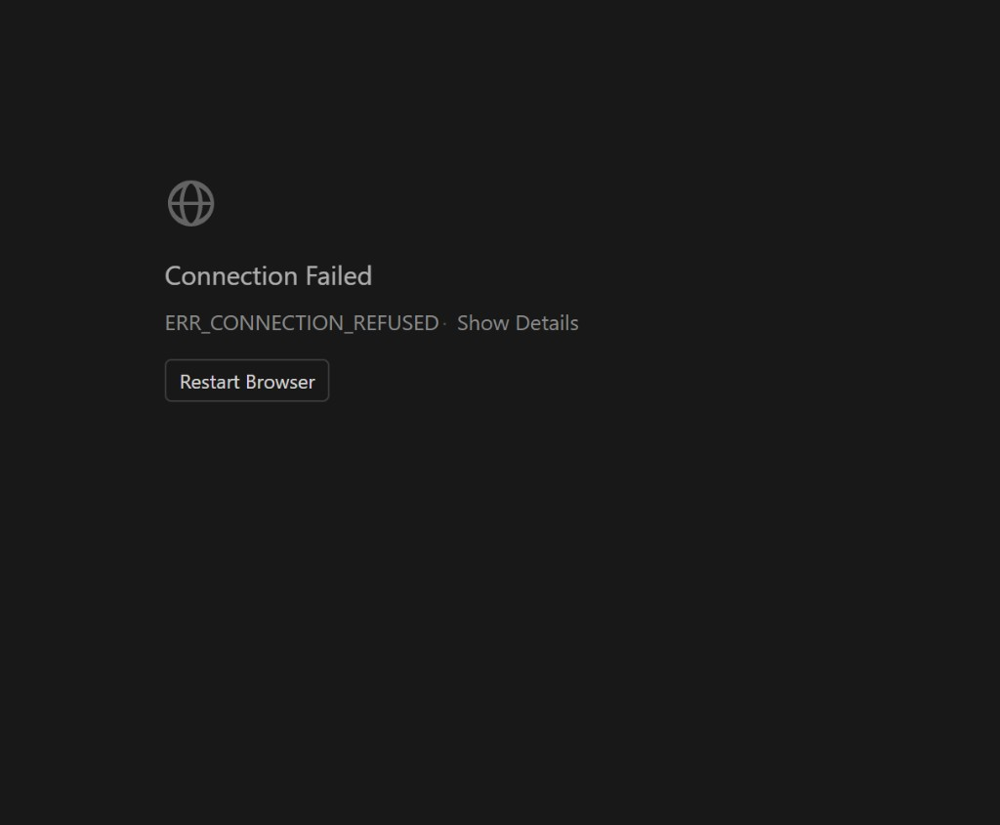

# Orbit Social Media Application — Handbook (PDF-ready)

**Product:** Orbit — a photo-first social web application  
**Primary surfaces:** Feed, Reels, Messages, Profile (plus authentication)  
**Tech stack (current codebase):** Next.js (App Router), Tailwind CSS, Supabase (Auth + Postgres when configured), Vercel hosting  
**Document purpose:** Explain what Orbit is, why it exists, how it is used, how it was created through staged delivery, what the key features are, how it reaches audiences, what issues were encountered, and what to improve next time.

---

## How to export this document to PDF (recommended)

### Option A — Microsoft Word / Google Docs (fastest, best layout control)

1. Open this file in an editor that renders Markdown (VS Code preview, GitHub, etc.).
2. Copy the rendered content into **Word** or **Google Docs**.
3. Insert/replace screenshots from `docs/assets/` as needed (drag images into the doc).
4. Add a **Cover page** + **Table of contents** (Word: References → Table of Contents).
5. Export: **File → Save As / Download → PDF**.

### Option B — Pandoc (automated, optional)

If you install Pandoc locally, you can convert Markdown to PDF with a PDF engine (requires a LaTeX distribution or an engine like `wkhtmltopdf`). This repo does not require Pandoc for development.

---

## Cover page content (paste at top of your PDF)

**Title:** Orbit Social Media Application — Engineering & Product Handbook  
**Subtitle:** Feed, Reels, Messages, Profile + Authentication (Supabase + Vercel)  
**Author:** Baljinder Singh Rai / BaljinderSingh (team)  
**Repository:** `balisikh/orbit-social-media-application`  
**Deployment platform:** Vercel  
**Backend platform:** Supabase  
**Date:** April 2026  
**Live URL (current):** `https://orbit-social-media-application.vercel.app/`  

---

## 1) Executive summary

Orbit is designed as a modern social product with four core modules:

- **Feed** for browsing posts.
- **Reels** for short vertical video.
- **Messages** for direct conversations.
- **Profile** for identity and a portfolio grid of posts.

The application is engineered to run locally for development, and to deploy to production using **Vercel**. In the current deployment, Supabase is not configured and Orbit runs in **Local mode** (browser-only data) so users can try the full UI without a backend.

---

## 2) What Orbit is (definition)

Orbit is a **dynamic website** (server-rendered routes + client interactions) that provides social-media workflows:

- **Authentication:** sign up and sign in (Supabase email/password when configured; **Local mode** browser-only sessions when not configured).
- **Profile identity:** display name, username/handle, bio, avatar.
- **Content publishing:** posts (including slideshow-style multi-media posts in local mode paths) and reels.
- **Social graph primitives:** follow-related flows exist in the codebase for Supabase-backed usage (depending on migrations and configuration).

---

## 3) Why Orbit exists (purpose)

### Product purpose

- Provide a **cohesive** experience across Feed/Reels/Messages/Profile.
- Prioritize **photo-first** consumption patterns (feed + profile grids).
- Support a realistic path to production hosting (Vercel) with a real backend (Supabase).

### Engineering purpose

- Keep UI responsive across **mobile, tablet, and desktop** using Tailwind breakpoints (`sm`, `md`, `lg`, …).
- Keep authentication and session refresh predictable in production.
- Separate **local preview** development behavior from **production** behavior.
- Support a **Local mode** deployment on Vercel (no Supabase) for demo/portfolio use, where data is saved per-browser.

---

## 4) How Orbit is used (user journeys)

### Journey A — New user onboarding

1. User visits `/auth/signup`.
2. User creates an account (Supabase or Local mode).
3. User completes profile basics on `/me/edit` (display name, @handle, bio, avatar).
4. User creates a first post on `/me/post/new`.
5. User sees content on `/feed` and `/me`.

### Journey B — Returning user

1. User visits `/auth/login`.
2. User lands on `/feed`.
3. User checks `/reels` and `/messages`.
4. User visits public profile `/u/[handle]` (when handle exists).

### Journey C — Password recovery

1. User visits `/auth/forgot-password`.
2. Supabase sends reset email (only when Supabase is configured; Local mode does not support password reset emails).
3. User completes `/auth/update-password` after the callback flow.

---

## 5) Stages and process (create → design → develop → test → deploy)

### Stage 1 — Concept and scope

**Outputs:** feature list, MVP boundaries, success metrics.

**Orbit MVP modules captured in this repo:** Feed, Reels, Messages, Profile, Auth.

### Stage 2 — UX and information architecture

**Outputs:** route map and primary navigation.

**Primary routes (App Router):**

- `/feed`
- `/reels`, `/reels/new`
- `/messages`
- `/me`, `/me/edit`, `/me/post/new`
- `/u/[handle]`
- `/auth/login`, `/auth/signup`, `/auth/forgot-password`, `/auth/update-password`, `/auth/callback`

### Stage 3 — System design

**Outputs:** data model direction, auth strategy, deployment strategy.

**Key decisions reflected in the codebase:**

- **Supabase** for cloud auth and persistence when `NEXT_PUBLIC_SUPABASE_URL` and `NEXT_PUBLIC_SUPABASE_ANON_KEY` are configured.
- **Vercel** for hosting and continuous deployment from GitHub.
- **Local mode fallback (no Supabase):** allows sign in + full UI demos on Vercel with browser-only storage.

### Stage 4 — Development

**Outputs:** implemented UI + API routes + database migrations (SQL under `supabase/migrations/`).

**Engineering notes from this project lifecycle:**

- Next.js 16 introduced a rename from root `middleware` convention to **`proxy`** convention for edge/session refresh patterns.
- Responsive rules were tuned for:
  - **Portrait single-image posts** vs **slideshow posts** in the feed.
  - **Profile grids** across breakpoints.

### Stage 5 — Testing

**Minimum production test checklist:**

- Auth: signup/login/logout/forgot password (as applicable)
- Profile: `/me` and `/me/edit` persistence
- Feed: post creation and rendering
- Reels: list + upload flow (as configured)
- Messages: inbox behavior (mode-dependent)
- Public profile: `/u/[handle]`

**Responsive test widths (examples):**

- Mobile: 360×800, 390×844, 412×915
- Tablet: 768×1024, 834×1194, 1024×1366
- Desktop: 1366×768, 1440×900, 1920×1080

### Stage 6 — Deployment (Vercel)

**Outputs:** live URL, environment configuration, monitoring.

**Screenshots included in this handbook (from your deployment flow):**

**Important deployment note:**\n+\n+- For **Supabase mode**, ensure `NEXT_PUBLIC_SUPABASE_URL` is your real Supabase URL (not a placeholder), and add `NEXT_PUBLIC_SUPABASE_ANON_KEY`.\n+- For **Local mode** (current live deployment), Supabase is intentionally not configured, and all data is stored in each browser.\n+\n+**Live deployment (current):** `https://orbit-social-media-application.vercel.app/`

---

## 6) Key features (what / why / how)

### 6.1 Feed (`/feed`)

- **What it is:** A scrolling stream of posts.
- **Why it exists:** Primary daily-use surface for social content consumption.
- **How it is used:** Users scroll posts, interact with actions provided by the UI (likes/comments/share vary by mode), and navigate to profile-related flows.

**Content-dependent UI behavior (important for documentation accuracy):**

- **Portrait photos + short captions:** framed for consistent card layout.
- **Slideshow posts:** framed for swipe/arrow navigation with consistent height on larger breakpoints.

### 6.2 Reels (`/reels`, `/reels/new`)

- **What it is:** Vertical short video browsing and publishing entry points.
- **Why it exists:** Short video is a distinct consumption pattern from static feed posts.
- **How it is used:** Users browse reels tabs and upload reels.

### 6.3 Messages (`/messages`)

- **What it is:** Direct messaging UI.
- **Why it exists:** Completes the social loop beyond public posting.
- **How it is used:**
  - With Supabase configured: server-backed messaging paths are used.
  - Without Supabase (development preview): local browser preview behavior may be used for demos.

### 6.4 Profile (`/me`, `/me/edit`, `/u/[handle]`)

- **What it is:**
  - `/me` is the signed-in owner profile hub.
  - `/u/[handle]` is the public profile page for a handle.
- **Why it exists:** Identity + portfolio + shareable profile link.
- **How it is used:** Users set display name, username/handle, bio, avatar; visitors can follow/message depending on configuration.

### 6.5 Authentication (`/auth/login`, `/auth/signup`, password reset pages)

- **What it is:** Email/password authentication via Supabase when configured; otherwise Local mode creates a browser-only session so users can use Orbit without a backend.
- **Why it exists:** Secure accounts and server-backed personalization.
- **How it is used:** Users sign up/sign in; sessions are maintained for app routes. In Local mode, sessions and data persist in browser storage for that domain.

---

## 7) Reaching target audiences (distribution and growth)

### Who the product is for (example segments)

- **Creators** who want a simple portfolio + posting flow.
- **Friends/community groups** who want feed + DMs.
- **Early adopters** validating UX before scaling features.

### How Orbit can reach audiences

- **Shareable public profiles:** `/u/[handle]` links can be posted externally.
- **Invite loops:** “create account → follow → message” flows.
- **Content marketing:** demo reels/posts as examples in feed.

### Benefits to users

- **Fast onboarding:** clear module separation (Feed/Reels/Messages/Profile).
- **Cross-device UX:** responsive layouts tuned for common breakpoints.
- **Production viability:** deployable architecture reduces “prototype-only” risk.

---

## 8) Issues encountered (real examples from this project) + causes + mitigations

### Issue 1 — “Password reset is not available…” on production

- **Symptom:** reset page shows unavailable messaging.
- **Cause:** Supabase is not configured (Local mode). Password reset requires Supabase email delivery.
- **Mitigation:** either configure Supabase (URL + anon key + redirect URLs + email) or keep Local mode and remove password reset from expectations.

### Issue 2 — “Sign-in is not available on this server.”

- **Symptom:** login cannot proceed in production.
- **Cause:** earlier builds blocked sign in when Supabase was missing.
- **Mitigation:** implement **Local mode sign in** when Supabase is not configured (current approach on the live site).

### Issue 3 — Profile fields reverting / conflicting with auth metadata defaults

- **Symptom:** profile appears to revert toward email-local defaults after sessions.
- **Cause:** profile sync/merge logic previously favored provider defaults in ways that could overwrite intended profile row values; also confusion between local preview vs cloud mode.
- **Mitigation:** improve merge rules and keep a single “source of truth” strategy per environment; document the difference between preview and production.

### Issue 4 — Next.js middleware deprecation warning

- **Symptom:** build warns that middleware file convention is deprecated.
- **Cause:** Next.js 16 renamed the convention to `proxy`.
- **Mitigation:** migrate root `middleware.ts` to `proxy.ts` exporting `proxy`.

### Issue 5 — Network connectivity errors during testing

The following screenshot captures a browser-level connectivity failure (`ERR_NETWORK_IO_SUSPENDED`). This is not an Orbit application logic error by itself, but it is a realistic operational issue during local testing or unstable networks.

- **Mitigation:** retry on stable network; restart browser; verify VPN/proxy; verify local dev server is running; verify deployed site DNS/SSL on Vercel.

Additionally, a local dev server can show `ERR_CONNECTION_REFUSED` when the Next.js dev server is not running or the wrong URL is used (e.g. opening a Vercel URL as if it were localhost).

---

## 9) Screenshots you should add for a “complete” PDF (recommended next captures)

The screenshots included above cover **Vercel project creation + env var entry**. For a complete stakeholder PDF, add these additional screenshots (name them consistently under `docs/assets/`):

1. **Orbit live site** `/feed`, `/reels`, `/messages`, `/me`, `/me/edit`, `/auth/login` (showing Local mode banner)
2. **Data transfer UI** on `/me/edit` (Export/Import local data)
3. **Vercel deployment success** page showing “Ready” and the live domain
4. (Optional, if moving back to Supabase) **Supabase dashboard → API keys** and **Auth URL configuration** (blur secrets)

---

## 10) Conclusion — what to do next time (process improvements)

1. **Decide the deployment mode early:**\n+   - **Local mode** for demo/portfolio (browser-only, no shared data)\n+   - **Supabase mode** for real multi-user use (shared database + auth)\n+2. **Pre-deploy checklist** pinned in the repo README or team wiki (Supabase mode):\n+   - `NEXT_PUBLIC_SUPABASE_URL`\n+   - `NEXT_PUBLIC_SUPABASE_ANON_KEY`\n+   - Supabase redirect URLs include `/auth/callback`\n+   - migrations applied
2. **CI gate:** run `tsc`, `lint`, and `build` on every PR.
3. **Separate “preview vs production” documentation** so testers do not confuse local preview behavior with cloud persistence.
4. **Operational monitoring:** Vercel deployment logs + Supabase auth logs for first-day issues.

---

## Appendix A — Glossary

- **Vercel:** hosting and deployment for the Next.js app.
- **Supabase:** managed Postgres + authentication APIs.
- **RLS:** row-level security policies in Postgres.
- **`NEXT_PUBLIC_*` variables:** bundled into client-side code; must be safe/public values.

---

## Appendix B — File map for screenshots used in this handbook

- `./assets/vercel-new-project-import.png`
- `./assets/vercel-new-project-env-vars.png`
- `./assets/error-connection-failed-network-io-suspended.png`
- `./assets/error-connection-refused.png`
